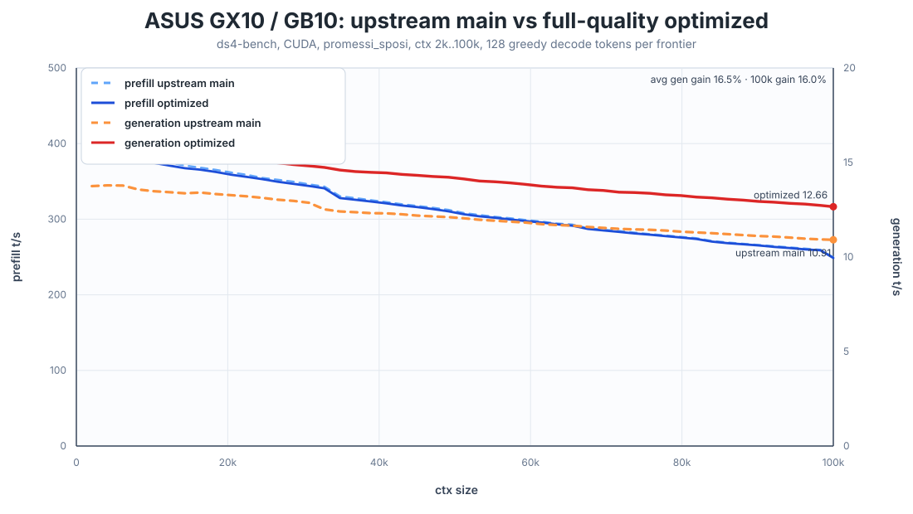

# ASUS GX10 / GB10 Speed Comparison

This benchmark compares upstream `main` with the GX10 full-quality optimized
CUDA path on an ASUS GX10 / NVIDIA GB10.



## Code Under Test

| Variant | Revision | Notes |
| --- | --- | --- |
| Upstream main | `bfe070a` (`Stabilize agent session IDs`) | Clean `origin/main` worktree |
| Full-quality optimized | `ff2a675` (`Fix decode top-k constant after upstream rebase`) | Current `gx10-cuda-graph-decode` branch before adding these benchmark artifacts |

These raw measurements were collected before the final cleanup/rebase branch was
created. The branch containing this file ports the same opt-in set onto the
current upstream `main` base, `ad0209f`.

The optimized run uses the current quality-preserving performance set:

```sh
DS4_CUDA_GRAPH_DECODE=1
DS4_CUDA_Q8_SOA_CACHE=1
DS4_CUDA_INDEXER_SCORE_TOPK_FUSED=1
```

The rejected faster-but-not-full-quality combinations are intentionally not used
here. In particular, the MoE const-stride compound was not included because the
current-branch same-snapshot gate showed token/hash drift.

## Method

Both variants were built with:

```sh
make -j$(nproc) cuda-spark
```

The benchmark command was:

```sh
./ds4-bench --cuda \
  -m /home/alessandro/projects/ds4/ds4flash.gguf \
  --prompt-file speed-bench/promessi_sposi.txt \
  --ctx-start 2048 \
  --ctx-max 100000 \
  --step-incr 2048 \
  --ctx-alloc 100200 \
  --gen-tokens 128 \
  --csv <output.csv>
```

The benchmark records instantaneous prefill and greedy decode throughput at
each context frontier. Generation is the primary metric for this tuning work.

## Results

| Context | Upstream gen t/s | Optimized gen t/s | Gain | Upstream prefill t/s | Optimized prefill t/s | Prefill delta |
| ---: | ---: | ---: | ---: | ---: | ---: | ---: |
| 8,192 | 13.57 | 15.74 | +16.0% | 385.19 | 380.03 | -1.3% |
| 32,768 | 12.52 | 14.74 | +17.7% | 343.21 | 340.86 | -0.7% |
| 65,536 | 11.66 | 13.66 | +17.2% | 292.98 | 291.42 | -0.5% |
| 100,000 | 10.91 | 12.66 | +16.0% | 249.71 | 248.73 | -0.4% |

Across the 49 common context points from 2k to 100k, the optimized path improves
generation throughput by **+16.5% average**. Prefill is essentially neutral for
this comparison, averaging **-0.6%**.

## Artifacts

| File | Description |
| --- | --- |
| [`upstream_main.csv`](upstream_main.csv) | Raw upstream main benchmark CSV |
| [`optimized_full_quality.csv`](optimized_full_quality.csv) | Raw optimized full-quality benchmark CSV |
| [`comparison_summary.csv`](comparison_summary.csv) | Per-context delta table |
| [`upstream_main_ts.svg`](upstream_main_ts.svg) | Upstream-only speed graph |
| [`optimized_full_quality_ts.svg`](optimized_full_quality_ts.svg) | Optimized-only speed graph |
| [`gx10_gb10_main_vs_optimized_ts.svg`](gx10_gb10_main_vs_optimized_ts.svg) | Combined comparison graph |
