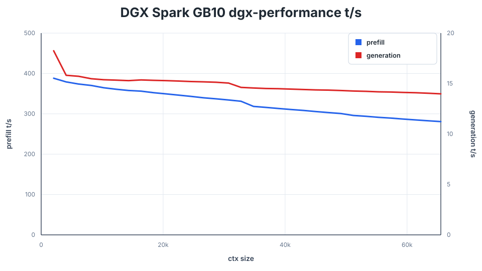

# DGX Spark GB10: `dgx-performance` with the upstream README sweep

This report runs the `dgx-performance` worktree at `8251c0a` with the exact
frontier shape published by upstream's current GB10 table: the 0731 IQ2XXS/
w2Q2K Flash GGUF, `Promessi sposi`, 2048-token steps from 2048 through 65536,
and 128 generated tokens. The command is recorded in
[`provenance.txt`](provenance.txt) and the complete 32-row result in
[`dgx_performance.csv`](dgx_performance.csv).

The extra `DS4_BENCH_FORCE_SNAPSHOT=1` only prevents the known long-context
prefix-replay fallback on this host; it preserves the per-frontier measurement.
The CUDA build deliberately has no explicit `CUDA_ARCH`, matching the current
GB10 CUDA recommendation in upstream's README.

## Published-table comparison

Upstream values come from `main` at `b030961`, in its
`speed-bench/gb10.csv`, whose GB10 table was refreshed by `e0c63d9`. They were not re-run in the same thermal session,
so these are comparable methodology and model, but not yet a paired A/B result.

| Context | `main` prefill | `dgx-performance` prefill | Prefill delta | `main` generation | `dgx-performance` generation | Generation delta |
| ---: | ---: | ---: | ---: | ---: | ---: | ---: |
| 2048 | 825.76 t/s | 388.20 t/s | -52.99% | 18.05 t/s | 18.25 t/s | **+1.11%** |
| 16384 | 872.44 t/s | 356.18 t/s | -59.17% | 15.10 t/s | 15.36 t/s | **+1.72%** |
| 32768 | 855.94 t/s | 331.13 t/s | -61.31% | 14.43 t/s | 14.62 t/s | **+1.32%** |
| 65536 | 822.98 t/s | 280.72 t/s | -65.89% | 13.84 t/s | 13.98 t/s | **+1.01%** |

Across all 32 frontiers, the arithmetic means are 327.07 versus 852.73 t/s
prefill (-61.64%) and 14.88 versus 14.65 t/s generation (**+1.56%**) for
`dgx-performance` versus `main`.

The sweep therefore supports the observation that this branch's decode is
slightly faster than the current published upstream GB10 table, while upstream
is substantially faster at prefill. This is a throughput-only measurement; it
does not replace a fresh paired A/B or a quality check and must not alone drive
a service deployment decision.

