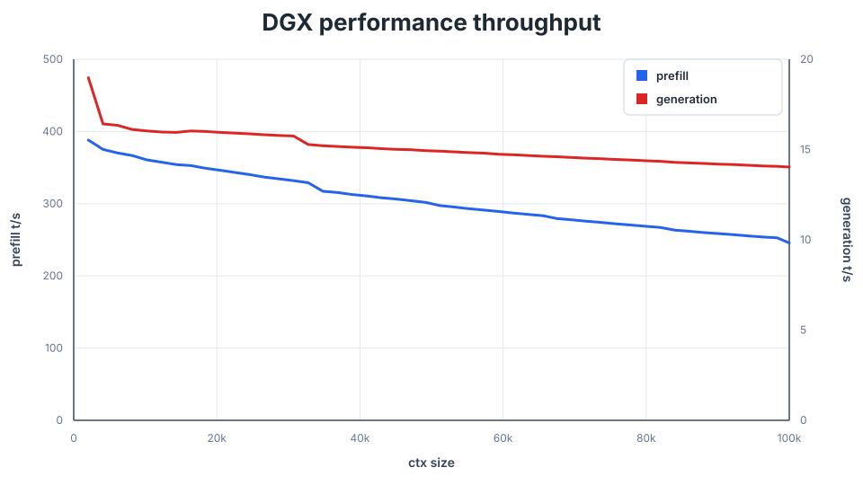

# ASUS GX10 / GB10 fused decode benchmark

This benchmark compares upstream `main` with a focused CUDA decode optimization
branch on ASUS GX10 / NVIDIA GB10.



## Code under test

| Variant | Revision | Notes |
| --- | --- | --- |
| Upstream main | `54b36ed` | Clean `origin/main` worktree |
| Fused HC decode | `a1edf72` | Branch `dgx-performance` |

The optimized branch keeps the quality-preserving GB10 decode changes that
measured as useful without increasing KV/cache memory. It intentionally does
not include the experimental SoA Q8 cache path, which used more CUDA memory and
failed with CUDA graph capture in agent testing.

## Method

Both variants were built with:

```sh
make -B -j$(nproc) ds4-bench CUDA_ARCH=
```

The benchmark command was:

```sh
DS4_BENCH_FORCE_SNAPSHOT=1 ./ds4-bench --cuda \
  -m /home/alessandro/projects/ds4/ds4flash.gguf \
  --prompt-file speed-bench/promessi_sposi.txt \
  --ctx-start 2048 \
  --ctx-max 100000 \
  --step-incr 2048 \
  --ctx-alloc 100200 \
  --gen-tokens 128 \
  --csv <output.csv>
```

`DS4_BENCH_FORCE_SNAPSHOT=1` saves a benchmark snapshot after the timed
frontier, avoiding repeated prompt replay while leaving the timed throughput
measurement unchanged. No runtime performance environment variables were
enabled for the optimized run. `kvcache_bytes` is identical at every measured
context point.

## Results

| Context | Upstream gen t/s | Optimized gen t/s | Gain | Upstream prefill t/s | Optimized prefill t/s | KV delta |
| ---: | ---: | ---: | ---: | ---: | ---: | ---: |
| 8,192 | 15.30 | 16.11 | +5.29% | 365.45 | 366.64 | 0 |
| 32,768 | 14.55 | 15.28 | +5.02% | 330.19 | 329.05 | 0 |
| 65,536 | 13.95 | 14.63 | +4.87% | 283.82 | 283.43 | 0 |
| 100,000 | 13.40 | 14.03 | +4.70% | 246.45 | 245.63 | 0 |

Across the 49 common context points from 2k to 100k, the optimized path improves
generation throughput by **+5.0% average**. Prefill is close to neutral,
averaging **-0.09%**.

## Optional tuning knobs

The branch also ships an opt-in MoE down-projection kernel that is **not**
enabled in the benchmark above:

```sh
DS4_CUDA_MOE_DOWN_TILE8_ROWSPAN=1
```

This selects a tile8 row-span kernel for the MoE down projection (only active
when the expert tile width is 8). On GB10 it gives a small prefill speedup; it
is left off by default so the measurements above reflect the stock decode path.

## Artifacts

| File | Description |
| --- | --- |
| [`upstream_main.csv`](upstream_main.csv) | Raw upstream main benchmark CSV |
| [`optimized_fused_hc.csv`](optimized_fused_hc.csv) | Raw optimized benchmark CSV |
| [`comparison_summary.csv`](comparison_summary.csv) | Per-context delta table |
| [`upstream_main_ts.svg`](upstream_main_ts.svg) | Upstream-only speed graph |
| [`optimized_fused_hc_ts.svg`](optimized_fused_hc_ts.svg) | Optimized-only speed graph |
| [`gx10_gb10_fused_hc_vs_main_ts.svg`](gx10_gb10_fused_hc_vs_main_ts.svg) | Generation comparison graph |
