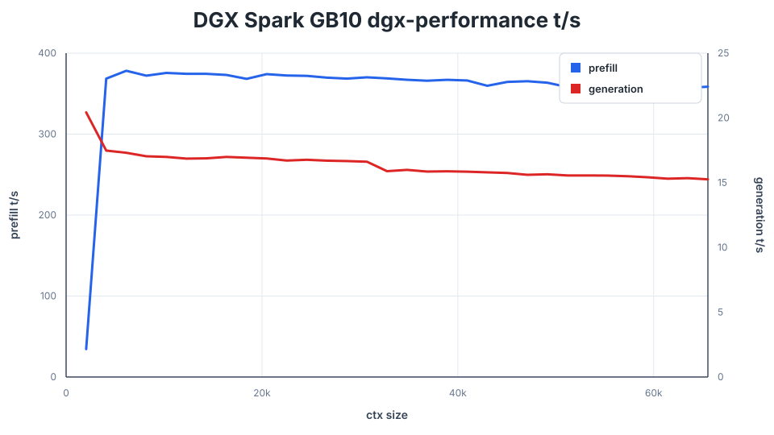

# GB10 after rebasing `dgx-performance` onto `main`

This is the same 32-frontier sweep as the upstream GB10 README table: the
DeepSeek V4 Flash Q2 0731 GGUF, `speed-bench/promessi_sposi.txt`, contexts from
2048 through 65536 in 2048-token steps, and 128 generated tokens. The command,
revision, GPU state, and resolved model path are in
[`provenance.txt`](provenance.txt); raw measurements are in
[`dgx_performance.csv`](dgx_performance.csv).

The selected file is
`DeepSeek-V4-Flash-IQ2XXS-w2Q2K-AProjQ8-SExpQ8-OutQ8-chat-v2-imatrix-0731.gguf`
(86,720,111,488 bytes). This is the current `ds4f-q2` target in upstream's
`download_model.sh`; imatrix calibration, experts, router, attention, and
output tensors are all inside this GGUF. No external model accessory was loaded.

## Results

| Context | Before rebase prefill | Rebased prefill | Prefill delta | Before rebase generation | Rebased generation | Generation delta |
| ---: | ---: | ---: | ---: | ---: | ---: | ---: |
| 2048 | 388.20 t/s | 34.49 t/s | -91.12% | 18.25 t/s | 20.43 t/s | **+11.95%** |
| 16384 | 356.18 t/s | 373.09 t/s | +4.75% | 15.36 t/s | 16.99 t/s | **+10.61%** |
| 32768 | 331.13 t/s | 368.83 t/s | +11.39% | 14.62 t/s | 15.89 t/s | **+8.69%** |
| 65536 | 280.72 t/s | 358.58 t/s | +27.74% | 13.98 t/s | 15.26 t/s | **+9.16%** |

Across all 32 frontiers, rebased `dgx-performance` averages **355.99 t/s**
prefill and **16.35 t/s** generation. That is **+8.84%** prefill and
**+9.84%** generation versus the pre-rebase `dgx-performance` sweep. Against
the current published `main` GB10 table, it is **-58.25%** prefill but
**+11.55%** generation.

## Interpretation

The decode-side benefits do combine: the rebased branch is decisively faster
than both the earlier DGX baseline and the published upstream rows. The full
prefill benefit does **not** combine yet. The first 2048-token row is an
outlier at 34.49 t/s, and [`benchmark.log`](benchmark.log) records 5,504
`aligned dense Q8 D2R returned -1` fallbacks while the new MMQ aligned-artifact
path is active. This needs a targeted raw-MMQ versus aligned-artifact A/B before
using prefill results for a service decision.

This is a throughput measurement only; it does not replace a real-prompt
quality check after the rebase.

